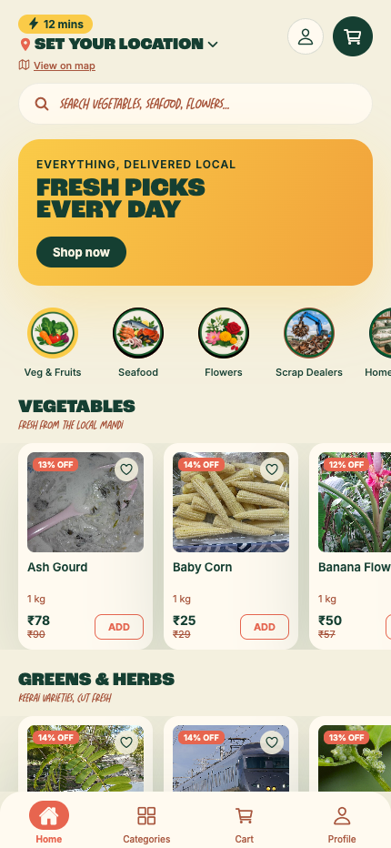
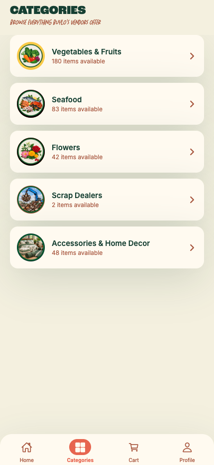
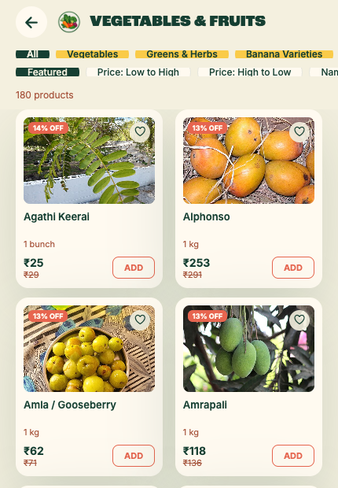
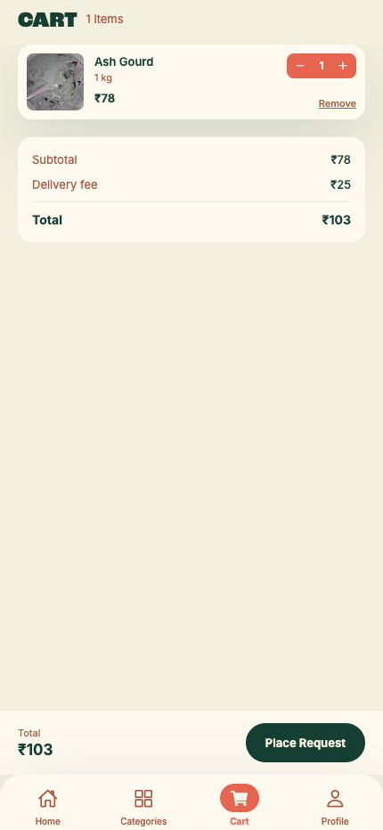
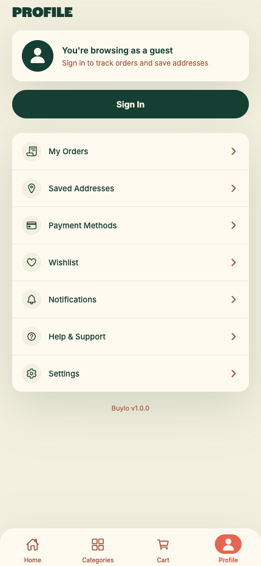

# Buylo

Buylo is a hyperlocal marketplace app that connects customers with nearby mobile vendors — vegetables, seafood, flowers, scrap collection, and home decor — instead of a fixed catalog. Customers place a request, nearby vendors respond, and the order is tracked live on a map until it arrives.

## Screenshots

<table>
  <tr>
    <td></td>
    <td></td>
    <td></td>
  </tr>
  <tr>
    <td></td>
    <td></td>
    <td></td>
  </tr>
</table>

## Features

- **Product catalog** — 350+ items across Vegetables & Fruits, Seafood, Flowers, Scrap Dealers, and Home Decor, with Tamil/English/Thanglish naming, sorting, and subcategory filters.
- **Live search** — instant search across all categories with add-to-cart directly from results.
- **Authentication** — email/password and Google sign-in via Clerk.
- **Cart & request flow** — customers build a cart and place a request rather than checking out directly, matching a hyperlocal vendor-response model.
- **Live order tracking** — once a vendor accepts, the customer sees a live map with the vendor's real position, moving along actual road geometry (via OSRM routing) with a real-time ETA countdown. Tracking persists across app navigation and reopens from the Cart or Profile screen.
- **Location-aware** — automatic GPS-based location detection with a live map view of the surrounding area.
- **Order history** — ongoing and completed requests are tracked in the Profile tab.
- **Wishlist, saved addresses, notification preferences** — full profile management.

## Tech stack

**Mobile app**
- React Native (Expo) + TypeScript
- React Context for state management (cart, wishlist, orders, location, products)
- `react-native-webview` + Leaflet.js + OpenStreetMap tiles for maps (no paid maps API)
- OSRM public routing API for road-based vendor tracking
- Clerk for authentication

**Backend**
- Kotlin + Ktor
- Neon (serverless Postgres) via HikariCP connection pooling
- REST API serving the product catalog, with the mobile app falling back to bundled local data if the backend is unreachable

## Project structure

```
mobile/
  App.tsx                  # Root app + navigation state
  src/
    components/            # UI components (dashboard, cart, auth, map, orders)
    context/                # React Context providers
    screens/                # Top-level screens
    data/                   # Product catalog + generated image map
    lib/                    # API client, vendor simulation helpers
  backend/                  # Ktor + Neon backend (separate service)
```

## Running locally

```bash
npm install
npx expo start --web       # or --android / --ios
```

The app expects a `.env` file with:

```
EXPO_PUBLIC_CLERK_PUBLISHABLE_KEY=pk_test_...
EXPO_PUBLIC_API_URL=http://localhost:8080
```
